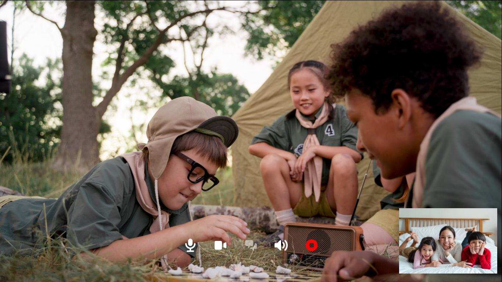

**Vica is a simple and elegant app for video/audio chat.** 

# How to Use

**prerequisite**
- nodejs(latest version recommended)
- npm

Inside the root directory, run 
```sh 
npm install && npm run start
```
then you can preview it at `localhost:3000` 

Currently vica basically provides two features:
- Web Camera chat
- Local Video Stream ( local video as source for streaming) 
- mix use of them is also supported

It does not require you know about the webRTC or anything to use vica,

#### Create/Join Chat

- **Peer A** click top-right button `Create` to jump into login page 
- **Peer A** click `Create Offer` to generate offer sdp, wait it until the offer contains `candidate`
- **Peer A** copy the offer and send it to **peer B** you wanna talk to 
- **Peer B**  click the `Join` button, and paste the the offer from **peer A** and receive it
- **Peer B**  proceed to next step and create answer sdp, wait it until the answer contains `candidate`
- **Peer B** copy the answer and send it back to **Peer A**
- **Peer A** paste the answer from **Peer B** and receive it.

All Done, now you can enjoy chatting with Vica!

# ScreenShots




# Development 

vica is built upon `react`, `tailwindcss`, so you have to install
them beforehand.

vica is simple video/audio chat app using webRTC, so make sure your development browser supportes it,
and you have basic understanding of webRTC.

vica does not implement server for and sdp/ice-candidate exchange or any other signalings 
(**NOTE** vica use sdp to exchange ice-candidate, so make sure the `offer`/`answer` created contains `candidate`-field),
instead manually copying and pasting is used here for simplicity and further development.

if you wanna implement them, there are many referrences/tutorials out there you can turn to.
see [webRTC API](https://developer.mozilla.org/en-US/docs/Web/API/WebRTC_API) and [webRTC Samples](https://github.com/webrtc/samples/) for more information.

and also vica does not complicate the login system, you should refine it.

obviously vica is not production-ready.
And hope you can make good of vica.

# Features to Add

- [ ] Improve local video capture quality (`captureStream`/`mozCaptureStream`  API is not suitable for basic use )
- [ ] Video Conferencing with multiple users
- [ ] Text Chat (It is easy to implement but just not yet)
- [ ] More to go

# known Issues

- Due to the [limit](https://mediasoup.discourse.group/t/firefox-ice-failed-add-a-stun-server-and-see-about-webrtc-for-more-details/805) of Firefox,
local video streaming is currently not tested at Firefox.
- Local Video Stream use API `captureStream`/`mozCaptureStream` which usually result in video quality loss, so use it with care!
